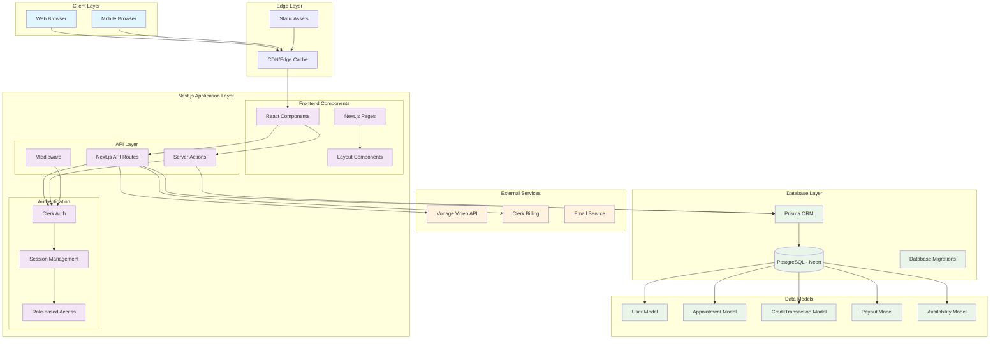
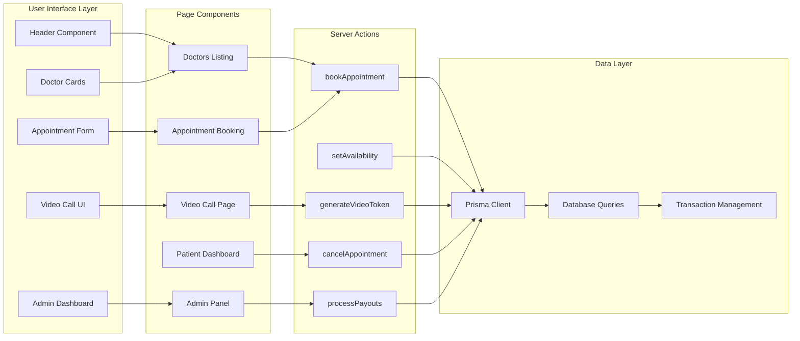
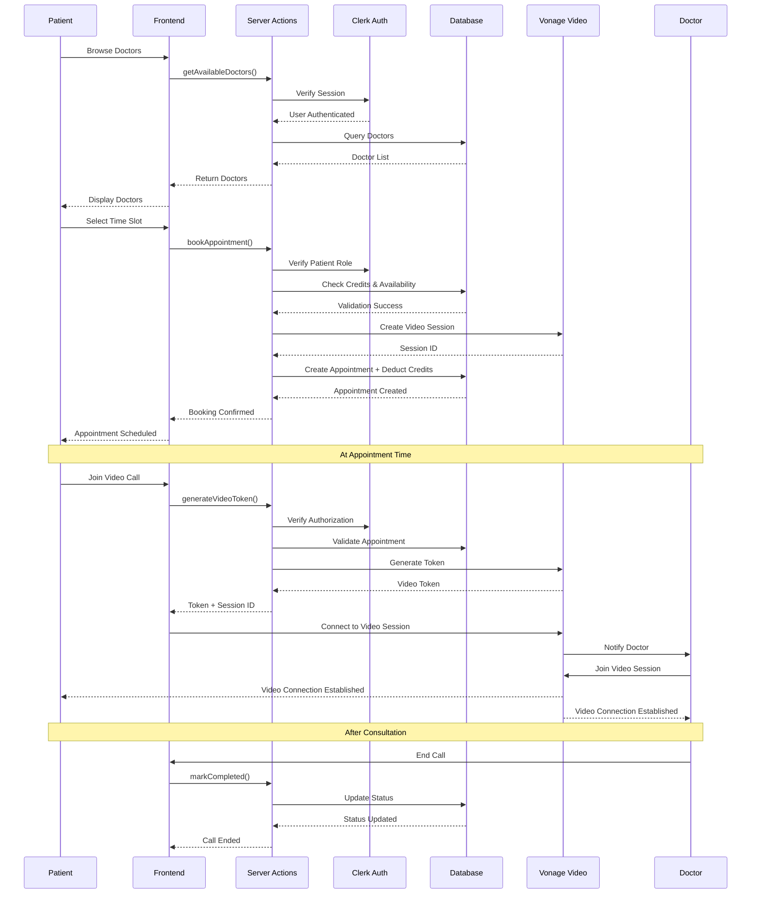
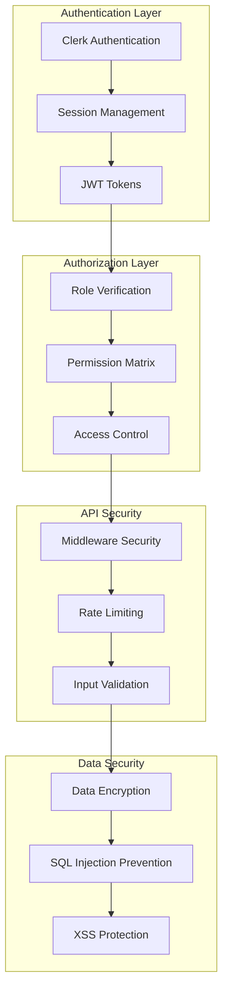
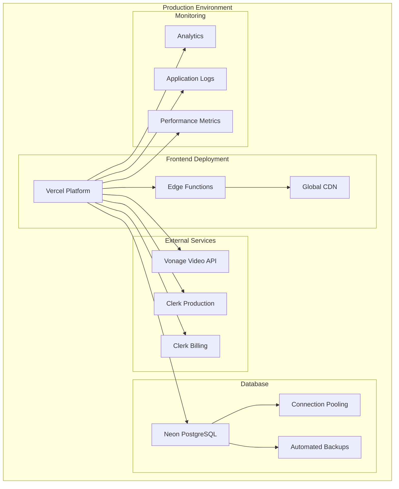

# Doctor's Appointment Platform - Architecture Diagram

## System Architecture Overview

## Component Architecture

## Data Flow Architecture

## Security Architecture

## Deployment Architecture

## Key Architecture Decisions

### 1. **Next.js App Router**
- **Server Components**: For better performance and SEO
- **Server Actions**: For form handling without API routes
- **Middleware**: For authentication and route protection

### 2. **Database Design**
- **Prisma ORM**: Type-safe database operations
- **PostgreSQL**: ACID compliance for financial transactions
- **Connection Pooling**: Efficient database connections

### 3. **Authentication Strategy**
- **Clerk**: Complete auth solution with role management
- **JWT Tokens**: Stateless authentication
- **Role-based Access**: Granular permissions

### 4. **Video Integration**
- **Vonage Video API**: Enterprise-grade video calling
- **WebRTC**: Low-latency communication
- **Session Management**: Secure token-based access

### 5. **Payment Processing**
- **Clerk Billing**: Integrated subscription management
- **Credit System**: Internal currency for appointments
- **Transaction Logging**: Complete audit trail

This architecture ensures scalability, security, and maintainability while providing a seamless user experience for both patients and doctors.
